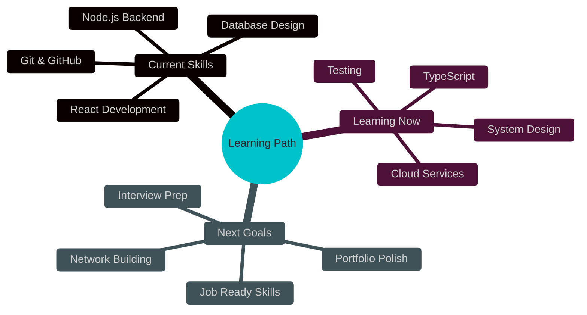

<h1 align="center">
  
</h1>

<p align="center">
  
</p>

<div align="center">
  
  [](your-portfolio)
  [](your-linkedin)
  [](mailto:your-email)
  [](your-twitter)
  
  
  
</div>

<br/>

<p align="center">
  
</p>

<br/>

##  WHO AM I?


### 👋 Hi there! I'm Nashid

I'm a **self-taught developer** from **Bengaluru, India** 🇮🇳 passionate about building things with code!

```javascript
const nashid = {
  status: "Self-Learning & Building Projects",
  location: "Bengaluru, India",
  goal: "Land My First Developer Job",
  
  learning: [
    "📚 Full Stack Development",
    "⚛️ React & Modern JavaScript",
    "🟢 Node.js & Express",
    "🗄️ Database Management",
    "🎨 UI/UX Best Practices"
  ],
  
  journey: {
    started: "2022",
    projects_built: "10+",
    lines_of_code: "50,000+",
    coffee_consumed: "☕☕☕ countless cups"
  },
  
  mindset: "Every expert was once a beginner 🌱"
};
```

### 🎯 My Mission
> Building real projects • Learning every day • Growing my skills • Ready for opportunities

<br clear="right"/>

<br/>

<p align="center">
  
</p>

<br/>

##  SKILLS I'M BUILDING

<div align="center">

### 💻 Frontend Development


### ⚙️ Backend Development


### 🛠️ Tools & Learning


</div>

<br/>

<p align="center">
  
</p>

<br/>

##  MY LEARNING JOURNEY

<div align="center">
  
  
</div>

<div align="center">
  
  
</div>

<div align="center">
  
</div>

### 📊 My Coding Progress

```text
Learning JavaScript    ██████████████████░░   90%
Building with React    ████████████████░░░░   80%
Backend Development    ██████████████░░░░░░   70%
Working with Database  ████████████░░░░░░░░   60%
Cloud & Deployment     ██████████░░░░░░░░░░   50%
```

<br/>

<p align="center">
  
</p>

<br/>

##  PROJECTS I'VE BUILT

<div align="center">

<table>
<tr>
<td width="50%" valign="top">

### 🛒 E-Commerce Website


**What I Built:**
- 🔐 User Login/Signup
- 🛍️ Product Catalog
- 🛒 Shopping Cart
- 💳 Checkout Flow
- 📱 Mobile Responsive

**Tech Used:** React • Node.js • MongoDB

**What I Learned:** Authentication, State Management, API Integration

</td>
<td width="50%" valign="top">

### 💬 Chat Application


**What I Built:**
- 💬 Real-time Messaging
- 👥 User Profiles
- 📎 Image Sharing
- 🔔 Notifications
- 🎨 Custom UI

**Tech Used:** React • Socket.io • Express

**What I Learned:** WebSockets, Real-time Communication

</td>
</tr>
<tr>
<td width="50%" valign="top">

### 📝 Todo App with Backend


**What I Built:**
- ✅ CRUD Operations
- 👤 User Authentication
- 📊 Task Analytics
- 🎯 Categories
- 💾 Database Integration

**Tech Used:** React • Express • PostgreSQL

**What I Learned:** REST APIs, Database Design

</td>
<td width="50%" valign="top">

### 🎨 Personal Portfolio


**What I Built:**
- 📱 Responsive Design
- 🎨 Animations
- 📧 Contact Form
- 🚀 Fast Loading
- ⚡ Modern UI

**Tech Used:** React • Tailwind CSS • AWS

**What I Learned:** UI/UX, Deployment, Performance

</td>
</tr>
</table>

</div>

<br/>

<p align="center">
  
</p>

<br/>

##  WHAT I'M LEARNING NOW



<br/>

<p align="center">
  
</p>

<br/>

##  MY LEARNING RESOURCES

<table align="center">
<tr>
<td width="50%">

### 📚 How I'm Learning

```yaml
online_courses:
  - freeCodeCamp
  - The Odin Project
  - YouTube Tutorials
  - Documentation

practice:
  - Building Projects
  - Daily Coding
  - Code Challenges
  - Reading Code

community:
  - GitHub
  - Stack Overflow
  - Dev.to
  - Twitter Dev Community
```

</td>
<td width="50%">

### 🎯 My Study Routine

```javascript
const dailyRoutine = {
  morning: [
    "☕ Coffee + Read docs",
    "📖 Learn new concepts"
  ],
  
  afternoon: [
    "💻 Build projects",
    "🐛 Debug & problem solve"
  ],
  
  evening: [
    "📝 Write code",
    "🔍 Review & refactor"
  ],
  
  goal: "Code every single day 🔥"
};
```

</td>
</tr>
</table>

<br/>

<p align="center">
  
</p>

<br/>

##  WHY HIRE ME?

<div align="center">

### 💪 What I Bring to the Table

<table>
<tr>
<td align="center" width="25%">

<br><br>
<b>🔥 Passion & Drive</b>
<br><br>
Self-taught and motivated<br>
Love solving problems<br>
Always eager to learn
</td>
<td align="center" width="25%">

<br><br>
<b>💻 Hands-on Experience</b>
<br><br>
Built 10+ real projects<br>
Understand full stack<br>
Clean, readable code
</td>
<td align="center" width="25%">

<br><br>
<b>🌱 Growth Mindset</b>
<br><br>
Quick learner<br>
Adaptable & flexible<br>
Open to feedback
</td>
<td align="center" width="25%">

<br><br>
<b>🤝 Team Player</b>
<br><br>
Good communicator<br>
Collaborative spirit<br>
Eager to contribute
</td>
</tr>
</table>

### 🎯 What I'm Looking For

```diff
+ Entry-level/Junior Developer roles
+ Internship opportunities
+ Freelance projects to build experience
+ Mentorship from senior developers
+ Companies that invest in junior talent
```

</div>

<br/>

<p align="center">
  
</p>

<br/>

##  FUN FACTS ABOUT ME

<div align="center">

### 💭 Developer Quote


### 😄 Keep Me Motivated


### 🎮 When I'm Not Coding

<table>
<tr>
<td align="center">🎵 Listening to music</td>
<td align="center">☕ Drinking coffee</td>
<td align="center">📚 Reading tech blogs</td>
</tr>
<tr>
<td align="center">🎮 Gaming</td>
<td align="center">🏃 Exercise</td>
<td align="center">🌱 Learning something new</td>
</tr>
</table>

</div>

<br/>

<p align="center">
  
</p>

<br/>

##  LET'S CONNECT!

<div align="center">

### 📧 I'm Available For

<table>
<tr>
<td align="center" width="33%">

<br><b>Job Opportunities</b>
<br>Junior/Entry-level roles
</td>
<td align="center" width="33%">

<br><b>Freelance Work</b>
<br>Small projects to gain experience
</td>
<td align="center" width="33%">

<br><b>Collaboration</b>
<br>Open source & learning together
</td>
</tr>
</table>

### 📬 Reach Out to Me

<a href="mailto:your-email">
  
</a>
<a href="your-linkedin">
  
</a>
<a href="your-twitter">
  
</a>
<a href="your-portfolio">
  
</a>

<br/><br/>

### 💌 Open to Opportunities


<br/><br/>

 
<br>
**"The only way to do great work is to love what you do." - Steve Jobs**
<br><br>
**Thanks for visiting! Let's build something great together!** 
<br>


</div>

<br/>

<p align="center">
  
</p>

<div align="center">
  
  **© 2024 Nashid K • Self-Taught Developer • Ready to Learn & Grow**
  
</div>
