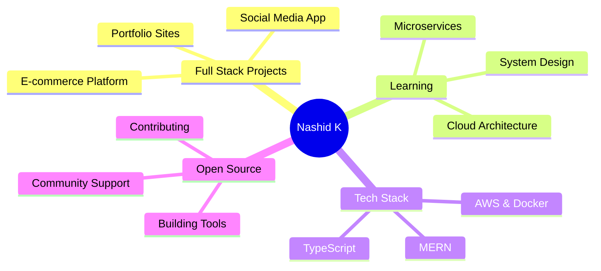

<div align="center">


</div>

<div align="center">
  
[](https://git.io/typing-svg)

</div>

---

<div align="center">

### 🌐 Connect With Me

[](your-portfolio-url)
[](your-linkedin-url)
[](your-twitter-url)
[](mailto:your-email)
[](https://github.com/nashid-k)


</div>

---


### 👨‍💻 About Me

```typescript
interface Developer {
  name: string;
  location: string;
  role: string;
  languages: string[];
  currentFocus: string;
  hobbies: string[];
  availableFor: string[];
}

const nashid: Developer = {
  name: "Nashid K",
  location: "Bengaluru, India 🇮🇳",
  role: "Full Stack Developer",
  
  languages: [
    "JavaScript", 
    "TypeScript", 
    "HTML/CSS"
  ],
  
  currentFocus: "Building microservices & cloud architecture",
  
  hobbies: [
    "💻 Coding",
    "🎵 Music", 
    "📚 Learning",
    "☕ Coffee"
  ],
  
  availableFor: [
    "Full-time opportunities",
    "Freelance projects",
    "Open source collaboration",
    "Tech discussions"
  ]
};
```

<br clear="right"/>

---

<div align="center">

## 🛠️ Tech Stack

### Frontend


### Backend


### Tools & Platforms


</div>

---

<div align="center">

## 📊 GitHub Statistics


</div>

---

<div align="center">

## 🏆 GitHub Trophies


</div>

---

<div align="center">

## 📈 Contribution Graph


</div>

---

<div align="center">

## 💼 What I'm Working On



</div>

---

<div align="center">

## 📝 Latest Blog Posts

<!-- BLOG-POST-LIST:START -->
- 🚀 Building Scalable APIs with Node.js and Express
- ⚡ TypeScript Best Practices for React Developers
- 🎨 Creating Responsive UIs with Tailwind CSS
- 🔐 JWT Authentication Implementation Guide
- 📊 Database Optimization Techniques
<!-- BLOG-POST-LIST:END -->

</div>

---

<div align="center">

## 🎯 Current Focus

<table>
  <tr>
    <td align="center" width="33%">
      <br>
      <b>Cloud Architecture</b><br>
      AWS, Microservices, Docker
    </td>
    <td align="center" width="33%">
      <br>
      <b>Full Stack Apps</b><br>
      MERN + TypeScript Projects
    </td>
    <td align="center" width="33%">
      <br>
      <b>System Design</b><br>
      Scalable Architecture Patterns
    </td>
  </tr>
</table>

</div>

---

<div align="center">

## 🎮 Fun Zone

### 💻 Coding Stats

```text
💼 Total Commits         : 500+
⭐ GitHub Stars          : 50+
🔀 Pull Requests        : 100+
📝 Code Reviews         : 200+
⏰ Years Coding         : 3+
🔥 Longest Streak       : 45 Days
```

### 🎲 Random Dev Quote


### 😄 Random Dev Joke


</div>

---

<div align="center">

## 🤝 Let's Connect!

I'm always interested in:
- 💼 New opportunities and collaborations
- 🚀 Innovative project ideas
- 🤝 Open source contributions
- 💬 Tech discussions and knowledge sharing

**"First, solve the problem. Then, write the code."** - John Johnson

<br>

### 💌 Reach Out

<a href="mailto:your-email@example.com">
  
</a>
<a href="your-linkedin">
  
</a>
<a href="your-portfolio">
  
</a>

<br><br>

### ☕ Support My Work

<a href="https://www.buymeacoffee.com/nashidk">
  
</a>

</div>

---

<div align="center">

### 📅 Pinned Repositories

[](https://github.com/nashid-k/your-repo-1)
[](https://github.com/nashid-k/your-repo-2)

</div>

---

<div align="center">


**Made with 💙 and ☕ by Nashid K**

</div>
