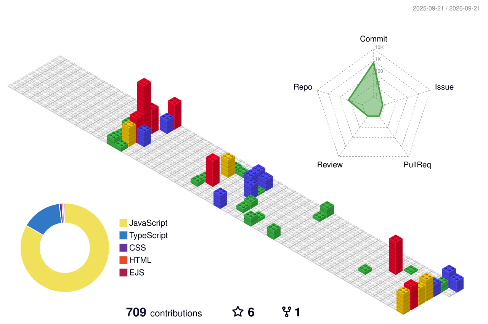

<!-- ══════════════════════════════════════════════════════════════════ -->
<!--             NASHID K  —  GITHUB PROFILE  README                  -->
<!--               Modern Minimalist Redesign (Monochrome)            -->
<!-- ══════════════════════════════════════════════════════════════════ -->

<!-- TYPOGRAPHY / BANNER HEADER -->


<div align="center">

<!-- ANIMATED TYPING -->
<a href="https://git.io/typing-svg"></a>

<br/>

<!-- STATUS:START --><!-- STATUS:END -->

<br/>

<!-- SOCIAL BADGES -->
<a href="https://www.linkedin.com/in/nashid-k-080909273/"></a>
&nbsp;
<a href="mailto:nashid.connect@gmail.com"></a>
&nbsp;


</div>

<br/>

---

<!-- ══════════════════════ PROFILE GRID ══════════════════════ -->

<br/>

<table width="100%" style="border-collapse: collapse; border: 1px solid #333333;">
<tr>
<td width="55%" valign="top" style="padding: 20px; border-right: 1px solid #333333;">

### `> whoami`

```typescript
const nashid: Engineer = {
  focus:   "Full-Stack · AI Systems · Performance",
  craft:   "building products users trust",

  stack: {
    frontend : ["Next.js", "React", "TypeScript", "Tailwind", "Framer"],
    backend  : ["Node.js", "REST APIs", "NextAuth", "Zod"],
    data     : ["MongoDB", "Mongoose", "Upstash Redis"],
    ai       : ["LLM orchestration", "multi-key resilience"],
    infra    : ["Vercel", "Docker", "Edge Functions"],
    testing  : ["Jest", "React Testing Library"],
  },

  principles: [
    "ship fast, break nothing",
    "type-safety from edge to DB",
    "performance is a feature",
    "AI should feel like magic",
  ],
};
```

</td>
<td width="45%" valign="top" style="padding: 20px;">

### `> telemetry --live`

<br/>

<table width="100%" style="border-collapse: collapse; font-family: monospace; font-size: 14px; line-height: 2.0;">
  <tr style="border-bottom: 1px solid #2d2d2d;">
    <td style="color: #8e8e93; padding: 4px 0;">⚡ Latency Cut</td>
    <td align="right" style="color: #ffffff; padding: 4px 0;"><code>30%</code></td>
  </tr>
  <tr style="border-bottom: 1px solid #2d2d2d;">
    <td style="color: #8e8e93; padding: 4px 0;">🟢 Live Uptime</td>
    <td align="right" style="color: #ffffff; padding: 4px 0;"><code>99.9%</code></td>
  </tr>
  <tr style="border-bottom: 1px solid #2d2d2d;">
    <td style="color: #8e8e93; padding: 4px 0;">🛡️ Security Incidents</td>
    <td align="right" style="color: #ffffff; padding: 4px 0;"><code>0</code></td>
  </tr>
  <tr style="border-bottom: 1px solid #2d2d2d;">
    <td style="color: #8e8e93; padding: 4px 0;">🔁 LLM Pool Resilience</td>
    <td align="right" style="color: #ffffff; padding: 4px 0;"><code>10x</code></td>
  </tr>
  <tr style="border-bottom: 1px solid #2d2d2d;">
    <td style="color: #8e8e93; padding: 4px 0;">🎨 UI Components Built</td>
    <td align="right" style="color: #ffffff; padding: 4px 0;"><code>21</code></td>
  </tr>
  <tr>
    <td style="color: #8e8e93; padding: 4px 0;">🔀 API Route Groups</td>
    <td align="right" style="color: #ffffff; padding: 4px 0;"><code>11</code></td>
  </tr>
</table>

<br/>

<div align="center">
  
  &nbsp;
  
  &nbsp;
  
</div>

</td>
</tr>
</table>

<br/>

---

<!-- ══════════════════════ TECH STACK ══════════════════════ -->

<div align="center">

### 🛠️ Tech Stack

<br/>

<a href="https://skillicons.dev">
  
</a>

</div>

<br/>

---

<!-- ══════════════════════ ENGINEERING DNA ══════════════════════ -->

<div align="center">

### ⚙️ Engineering DNA

<br/>

<table style="border-collapse: collapse; border: 1px solid #333333; text-align: center;">
<tr>
<td style="padding: 15px; border-right: 1px solid #333333; border-bottom: 1px solid #333333; width: 160px;">
<strong>🎯 Precision</strong><br/>
<sub style="color: #8e8e93;">TypeScript end-to-end.<br/>Zod-validated APIs.<br/>No silent failures.</sub>
</td>
<td style="padding: 15px; border-right: 1px solid #333333; border-bottom: 1px solid #333333; width: 160px;">
<strong>⚡ Speed</strong><br/>
<sub style="color: #8e8e93;">Redis caching.<br/>RSC-first rendering.<br/>Strict bundle checks.</sub>
</td>
<td style="padding: 15px; border-bottom: 1px solid #333333; width: 160px;">
<strong>🧱 Architecture</strong><br/>
<sub style="color: #8e8e93;">Feature-based domains.<br/>Clean interfaces.<br/>Designed for scale.</sub>
</td>
</tr>
<tr>
<td style="padding: 15px; border-right: 1px solid #333333; width: 160px;">
<strong>🛡️ Security</strong><br/>
<sub style="color: #8e8e93;">Secure HTTP headers.<br/>Strict rate limiting.<br/>Zero-incident record.</sub>
</td>
<td style="padding: 15px; border-right: 1px solid #333333; width: 160px;">
<strong>🤖 AI Systems</strong><br/>
<sub style="color: #8e8e93;">Context-aware agents.<br/>Failover pool logic.<br/>Optimal latency.</sub>
</td>
<td style="padding: 15px; width: 160px;">
<strong>✅ Quality</strong><br/>
<sub style="color: #8e8e93;">Jest & RTL coverage.<br/>ESLint enforced.<br/>Type-safe workflows.</sub>
</td>
</tr>
</table>

</div>

<br/>

---

<!-- ══════════════════════ FEATURED PROJECTS ══════════════════════ -->

<div align="center">

### 📁 Featured Projects

<br/>

<table width="100%" style="border-collapse: collapse; border: 1px solid #333333; text-align: left;">
  <tr>
    <td width="50%" valign="top" style="padding: 20px; border-right: 1px solid #333333; border-bottom: 1px solid #333333;">
      <strong>💻 <a href="https://github.com/Nashid-k/axiom-e-learning">axiom-e-learning</a></strong>
      <p style="font-size: 13px; color: #8e8e93; line-height: 1.5; margin: 8px 0 12px 0;">An interactive, secure e-learning application leveraging Next.js React Server Components, NextAuth, and optimized edge database queries.</p>
      <code>Next.js</code> &middot; <code>TypeScript</code> &middot; <code>Tailwind</code> &middot; <code>MongoDB</code>
    </td>
    <td width="50%" valign="top" style="padding: 20px; border-bottom: 1px solid #333333;">
      <strong>🔧 <a href="https://github.com/Nashid-k/antigravity-config">antigravity-config</a></strong>
      <p style="font-size: 13px; color: #8e8e93; line-height: 1.5; margin: 8px 0 12px 0;">Workspace configuration rules, custom prompts, and automated workflows tailored for the Google Antigravity IDE.</p>
      <code>JSON</code> &middot; <code>Markdown</code> &middot; <code>Configuration</code>
    </td>
  </tr>
  <tr>
    <td width="50%" valign="top" style="padding: 20px; border-right: 1px solid #333333;">
      <strong>👤 <a href="https://github.com/Nashid-k/Nashid-k">Nashid-k</a></strong>
      <p style="font-size: 13px; color: #8e8e93; line-height: 1.5; margin: 8px 0 12px 0;">Minimalist GitHub profile repository configured with automated Actions updating telemetry metrics synchronously.</p>
      <code>Node.js</code> &middot; <code>GitHub Actions</code> &middot; <code>SVG</code>
    </td>
    <td width="50%" valign="top" style="padding: 20px;">
      <strong>📦 Other Work</strong>
      <p style="font-size: 13px; color: #8e8e93; line-height: 1.5; margin: 8px 0 12px 0;">Various production-grade tools featuring Redis edge caching, secure LLM endpoints, and resilient cron-job scripts.</p>
      <code>Python</code> &middot; <code>Docker</code> &middot; <code>Redis</code>
    </td>
  </tr>
</table>

</div>

<br/>

---

<!-- ══════════════════════ STATS & GRAPH ══════════════════════ -->

<div align="center">

### 📊 Telemetry & Languages

<br/>


&nbsp;


<br/><br/>


<br/><br/>


</div>

<br/>

---

<!-- ══════════════════════ WORKSPACE ══════════════════════ -->

<div align="center">

### 🏢 Development Environment

<br/>

<table width="100%" style="border-collapse: collapse; border: 1px solid #333333;">
<tr>
<td width="50%" align="center" style="padding: 15px; border-right: 1px solid #333333;">

#### 🏙️ Activity City


</td>
<td width="50%" align="center" style="padding: 15px;">

#### 📊 Coding Stats (Weekly)
<!-- waka:start -->
<!-- waka:end -->

</td>
</tr>
</table>

</div>

<br/>

---

<!-- ══════════════════════ CONTRIBUTION SNAKE ══════════════════════ -->

<div align="center">

### 🐍 Contribution Path

<br/>

<picture>
  <source media="(prefers-color-scheme: dark)" srcset="https://raw.githubusercontent.com/Nashid-k/Nashid-k/output/github-contribution-grid-snake-dark.svg"/>
  <source media="(prefers-color-scheme: light)" srcset="https://raw.githubusercontent.com/Nashid-k/Nashid-k/output/github-contribution-grid-snake.svg"/>
  
</picture>

</div>

<br/>

---

<!-- ══════════════════════ CONNECT ══════════════════════ -->

<div align="center">

### 📡 Let's Connect

<br/>

> "Simplicity is the ultimate sophistication." — Leonardo da Vinci

<br/>

<a href="https://www.linkedin.com/in/nashid-k-080909273/" target="_blank">
  
</a>
&nbsp;&nbsp;
<a href="mailto:nashid.connect@gmail.com">
  
</a>

<br/><br/>

```
if you build things that matter — let's collaborate.
```

</div>

<br/>

<!-- METRIC FOOTER -->


---

<div align="center">
<sub>⚡ Powered by GitHub Actions & Open-Source Metrics.</sub>
</div>
