<div align="center">

# ✨ NASHID K ✨


</div>

```ascii
╔═══════════════════════════════════════════════════════════════════╗
║                                                                   ║
║   💻 Developer  •  🚀 Builder  •  ⚡ Problem Solver               ║
║                                                                   ║
╚═══════════════════════════════════════════════════════════════════╝
```

<div align="center">

[](https://career-pulse-phi.vercel.app)
[](https://linkedin.com/in/nashid-k-080909273)
[](mailto:nashidk1999@gmail.com)
[](https://github.com/Nashid-k)


</div>

---

## 👨‍💻 WHO AM I?

<table>
<tr>
<td width="60%">

**Full Stack Developer** from **Kerala, India** 🇮🇳 building responsive, scalable applications with the **MERN stack & TypeScript**.

```javascript
const nashid = {
  location: "Kerala, India 🇮🇳",
  role: "Full Stack Developer",
  focus: "MERN + TypeScript",
  
  expertise: [
    "🎨 Building intuitive UI/UX",
    "⚡ Developing secure REST APIs",
    "🏗️ Clean architecture & reusability",
    "🚀 Deploying production apps",
    "🔐 Authentication & security"
  ],
  
  currentlyBuilding: [
    "AI-powered web applications",
    "E-commerce platforms",
    "Real-time applications",
    "Scalable backend systems"
  ],
  
  experience: {
    projects: "10+ applications",
    focus: "Production-ready code",
    passion: "Problem solving"
  },
  
  workStyle: "Clean code • Fast learner • Team player"
};
```

</td>
<td width="40%">


**🎯 What I Do**

> Translating business requirements into intuitive interfaces • Building secure APIs • Optimizing performance • Deploying to production

</td>
</tr>
</table>

---

## 🛠️ TECHNICAL SKILLS

<div align="center">

**Frontend Development**


**Backend Development**


**Database & Storage**


**Cloud & Deployment**


**Tools & More**


</div>

---

## 📊 GITHUB STATISTICS

<div align="center">

<table>
<tr>
<td width="50%">


</td>
<td width="50%">


</td>
</tr>
</table>

<table>
<tr>
<td width="50%">


</td>
<td width="50%">


</td>
</tr>
</table>


<br/>

### 🏆 Achievements


</div>

---

## 🔄 DEVELOPMENT APPROACH

```mermaid
%%{init: {'theme':'dark', 'themeVariables': { 'primaryColor':'#00D9FF','primaryTextColor':'#fff','primaryBorderColor':'#00D9FF','lineColor':'#00D9FF','secondaryColor':'#1a1b27','tertiaryColor':'#1a1b27'}}}%%
flowchart LR
    A[💡 Requirements] --> B[📝 Planning]
    B --> C[🎨 UI/UX Design]
    C --> D[⚛️ Frontend Development]
    D --> E[🔐 Secure Backend APIs]
    E --> F[🗄️ Database Design]
    F --> G[🧪 Testing]
    G --> H{✅ Quality Check}
    H -->|Pass| I[🚀 Deploy to Production]
    H -->|Refactor| D
    I --> J[📊 Monitor & Optimize]
    J --> K[🔄 Iterate]
    
    style A fill:#00D9FF,stroke:#00D9FF,color:#000
    style B fill:#1a1b27,stroke:#00D9FF,color:#fff
    style C fill:#00D9FF,stroke:#00D9FF,color:#000
    style D fill:#1a1b27,stroke:#00D9FF,color:#fff
    style E fill:#00D9FF,stroke:#00D9FF,color:#000
    style F fill:#1a1b27,stroke:#00D9FF,color:#fff
    style G fill:#00D9FF,stroke:#00D9FF,color:#000
    style H fill:#ff6b6b,stroke:#ff6b6b,color:#fff
    style I fill:#00D9FF,stroke:#00D9FF,color:#000
    style J fill:#1a1b27,stroke:#00D9FF,color:#fff
    style K fill:#00D9FF,stroke:#00D9FF,color:#000
```

<div align="center">



</div>

---

## 💼 WHAT I BUILD

<table>
<tr>
<td width="50%" valign="top">

### 🎯 Application Types

```yaml
web_applications:
  - AI-Powered Tools
  - E-Commerce Platforms
  - Real-Time Systems
  - Content Management
  - Authentication Systems

focus_areas:
  - Responsive UI/UX
  - Secure REST APIs
  - Payment Integration
  - Role-Based Access Control
  - Cloud Deployment
```

</td>
<td width="50%" valign="top">

### 💼 Professional Experience

```javascript
const experience = {
  current: "Full Stack Developer",
  
  skills: {
    frontend: "React + TypeScript",
    backend: "Node.js + Express",
    database: "MongoDB + PostgreSQL",
    deployment: "AWS + Vercel"
  },
  
  achievements: [
    "10+ production applications",
    "Secure payment integrations",
    "Clean, scalable architecture",
    "Performance optimization"
  ]
};
```

</td>
</tr>
</table>

---

## 📈 CODING ACTIVITY

<div align="center">

### 📅 Development Focus

```text
React Development      ██████████████████░░░░░   85%
Node.js Backend        ████████████████░░░░░░░░   75%
TypeScript             ███████████████░░░░░░░░░   70%
Database Design        ██████████████░░░░░░░░░░   65%
API Development        ████████████████░░░░░░░░   80%
```

### 🔥 Contribution Heatmap


### ⏰ Activity Timeline


</div>

---

## 💪 PROFESSIONAL STRENGTHS

<table>
<tr>
<td align="center" width="25%">

**🏗️ Clean Architecture**

Reusable components  
Modular design patterns  
Scalable code structure

</td>
<td align="center" width="25%">

**🔐 Security First**

JWT authentication  
Secure API endpoints  
RBAC implementation

</td>
<td align="center" width="25%">

**⚡ Performance Focus**

Optimized workflows  
Fast load times  
Efficient queries

</td>
<td align="center" width="25%">

**🚀 Production Ready**

CI/CD pipelines  
Cloud deployment  
Monitoring & scaling

</td>
</tr>
</table>

---

## 📜 CERTIFICATIONS & LEARNING

<div align="center">

<table>
<tr>
<td align="center" width="50%">


**JavaScript (Basic) Certificate**  
Verified HackerRank Certification

</td>
<td align="center" width="50%">


**100+ Problems Solved**  
Algorithms & Data Structures

</td>
</tr>
</table>

</div>

---

## 🎲 FUN ZONE

<div align="center">

**💭 Developer Wisdom**


**😄 Daily Motivation**


**☕ When I'm Coding**

🎵 Music Playlist • ☕ Coffee Always • 🌙 Late Night Sessions  
🐛 Debug Detective • 📚 Always Learning • 🚀 Ship Fast

</div>

---

## 🤝 LET'S CONNECT!

<div align="center">

### 💼 Open For Opportunities

| 💻 **Full-Time Roles** | 🚀 **Freelance Projects** | 🤝 **Collaboration** |
|:---:|:---:|:---:|
| Full Stack Developer positions | Building production apps | Open source & team projects |

</div>

<br/>

<div align="center">

### 📬 Get In Touch

[](mailto:nashidk1999@gmail.com)
[](https://linkedin.com/in/nashid-k-080909273)
[](https://github.com/Nashid-k)
[](https://career-pulse-phi.vercel.app)

<br/>

### 💌 Current Status


</div>

---

<div align="center">

**"First, solve the problem. Then, write the code." - John Johnson**

<br/>

**Thanks for visiting! Let's build something amazing together!** 🚀

<br/>

**© 2024 Nashid K • Full Stack Developer • MERN + TypeScript**

</div>
