```mermaid
%%{init: {'theme':'dark', 'themeVariables': { 'primaryColor':'#00f7f7','primaryTextColor':'#fff','primaryBorderColor':'#00f7f7','lineColor':'#00f7f7','secondaryColor':'#006064','tertiaryColor':'#0D1117'}}}%%
flowchart TB
    A[💡 Requirements] --> B[📝 Planning]
    B --> C[🎨 UI/UX Design]
    C --> D[⚛️ Frontend Development]
    D --> E[🔐 Secure Backend APIs]
    E --> F[🗄️ Database Design]
    F --> G[🧪 Testing]
    G --> H{✅ Quality Check}
    H -->|Pass| I[🚀 Deploy to Production]
    H -->|Refactor| D
    I --> J[📊 Monitor & Optimize]
    J --> K[🔄 Iterate]
    
    style A fill:#00f7f7,stroke:#00f7f7,color:#000
    style B fill:#006064,stroke:#00f7f7,color:#fff
    style C fill:#00f7f7,stroke:#00f7f7,color:#000
    style D fill:#006064,stroke:#00f7f7,color:#fff
    style E fill:#00f7f7,stroke:#00f7f7,color:#000
    style F fill:#006064,stroke:#00f7f7,color:#fff
    style G fill:#00f7f7,stroke:#00f7f7,color:#000
    style H fill:#ff6b6b,stroke:#ff6b6b,color:#fff
    style I fill:#00f7f7,stroke:#00f7f7,color:#000
    style J fill:#006064,stroke:#00f7f7,color:#fff
    style K fill:#00f7f7,stroke:#00f7f7,color:#000
```

<h1 align="center">
  
</h1>

<p align="center">
  
</p>

<div align="center">
  
  [](https://career-pulse-phi.vercel.app)
  [](https://linkedin.com/in/nashid-k-080909273)
  [](mailto:nashidk1999@gmail.com)
  [](https://github.com/Nashid-k)
  
  
  
</div>

<br/>

<p align="center">
  
</p>

<br/>

##  WHO AM I?


### 👋 Hi there! I'm Nashid

**Full Stack Developer** from **Kerala, India** 🇮🇳 building responsive, scalable applications with the **MERN stack & TypeScript**.

```javascript
const nashid = {
  location: "Kerala, India 🇮🇳",
  role: "Full Stack Developer",
  focus: "MERN + TypeScript",
  
  expertise: [
    "🎨 Building intuitive UI/UX",
    "⚡ Developing secure REST APIs",
    "🏗️ Clean architecture & reusability",
    "🚀 Deploying production apps",
    "🔐 Authentication & security"
  ],
  
  currentlyBuilding: [
    "AI-powered web applications",
    "E-commerce platforms",
    "Real-time applications",
    "Scalable backend systems"
  ],
  
  experience: {
    projects: "10+ applications",
    focus: "Production-ready code",
    passion: "Problem solving"
  },
  
  workStyle: "Clean code • Fast learner • Team player"
};
```

### 🎯 What I Do
> Translating business requirements into intuitive interfaces • Building secure APIs • Optimizing performance • Deploying to production

<br clear="right"/>

<br/>

<p align="center">
  
</p>

<br/>

##  TECHNICAL SKILLS

<div align="center">

### 💻 Frontend Development


### ⚙️ Backend Development


### 🗄️ Database & Storage


### ☁️ Cloud & Deployment


### 🛠️ Tools & More


</div>

<br/>

<p align="center">
  
</p>

<br/>

##  GITHUB STATISTICS

<div align="center">
  
  
</div>

<div align="center">
  
  
</div>

<div align="center">
  
</div>

<br/>

<p align="center">
  
</p>

<br/>

##  ACHIEVEMENTS & MILESTONES

<div align="center">
  
</div>

<br/>

<p align="center">
  
</p>

<br/>

##  DEVELOPMENT APPROACH



<br/>

<p align="center">
  
</p>

<br/>

##  WHAT I BUILD

<table align="center">
<tr>
<td width="50%">

### 🎯 Application Types

```yaml
web_applications:
  - AI-Powered Tools
  - E-Commerce Platforms
  - Real-Time Systems
  - Content Management
  - Authentication Systems

focus_areas:
  - Responsive UI/UX
  - Secure REST APIs
  - Payment Integration
  - Role-Based Access Control
  - Cloud Deployment
```

</td>
<td width="50%">

### 💼 Professional Experience

```javascript
const experience = {
  current: "Full Stack Developer",
  
  skills: {
    frontend: "React + TypeScript",
    backend: "Node.js + Express",
    database: "MongoDB + PostgreSQL",
    deployment: "AWS + Vercel"
  },
  
  achievements: [
    "10+ production applications",
    "Secure payment integrations",
    "Clean, scalable architecture",
    "Performance optimization"
  ]
};
```

</td>
</tr>
</table>

<br/>

<p align="center">
  
</p>

<br/>

##  CODING ACTIVITY

<div align="center">

### 📅 Development Focus

```text
React Development      ██████████████████░░   85%
Node.js Backend        ████████████████░░░░   75%
TypeScript             ███████████████░░░░░   70%
Database Design        ██████████████░░░░░░   65%
API Development        ████████████████░░░░   80%
```

### 🔥 Contribution Heatmap


### ⏰ Activity Timeline


</div>

<br/>

<p align="center">
  
</p>

<br/>

##  PROFESSIONAL STRENGTHS

<div align="center">

<table>
<tr>
<td align="center" width="25%">

<br><br>
<b>🏗️ Clean Architecture</b>
<br><br>
Reusable components<br>
Modular design patterns<br>
Scalable code structure
</td>
<td align="center" width="25%">

<br><br>
<b>🔐 Security First</b>
<br><br>
JWT authentication<br>
Secure API endpoints<br>
RBAC implementation
</td>
<td align="center" width="25%">

<br><br>
<b>⚡ Performance Focus</b>
<br><br>
Optimized workflows<br>
Fast load times<br>
Efficient queries
</td>
<td align="center" width="25%">

<br><br>
<b>🚀 Production Ready</b>
<br><br>
CI/CD pipelines<br>
Cloud deployment<br>
Monitoring & scaling
</td>
</tr>
</table>

</div>

<br/>

<p align="center">
  
</p>

<br/>

##  CERTIFICATIONS & LEARNING

<div align="center">

### 📜 Technical Certifications

<table>
<tr>
<td align="center" width="50%">

<br><br>
<b>JavaScript (Basic) Certificate</b>
<br>
Verified HackerRank Certification
</td>
<td align="center" width="50%">

<br><br>
<b>100+ Problems Solved</b>
<br>
Algorithms & Data Structures
</td>
</tr>
</table>

</div>

<br/>

<p align="center">
  
</p>

<br/>

##  FUN ZONE

<div align="center">

### 💭 Developer Wisdom


### 😄 Daily Motivation


### ☕ When I'm Coding

<table>
<tr>
<td align="center">🎵 Music Playlist</td>
<td align="center">☕ Coffee Always</td>
<td align="center">🌙 Late Night Sessions</td>
</tr>
<tr>
<td align="center">🐛 Debug Detective</td>
<td align="center">📚 Always Learning</td>
<td align="center">🚀 Ship Fast</td>
</tr>
</table>

</div>

<br/>

<p align="center">
  
</p>

<br/>

##  LET'S CONNECT!

<div align="center">

### 💼 Open For Opportunities

<table>
<tr>
<td align="center" width="33%">

<br><b>Full-Time Roles</b>
<br>Full Stack Developer positions
</td>
<td align="center" width="33%">

<br><b>Freelance Projects</b>
<br>Building production apps
</td>
<td align="center" width="33%">

<br><b>Collaboration</b>
<br>Open source & team projects
</td>
</tr>
</table>

### 📬 Get In Touch

<a href="mailto:nashidk1999@gmail.com">
  
</a>
<a href="https://linkedin.com/in/nashid-k-080909273">
  
</a>
<a href="https://github.com/Nashid-k">
  
</a>
<a href="https://career-pulse-phi.vercel.app">
  
</a>

<br/><br/>

### 💌 Current Status


<br/><br/>

 
<br>
**"First, solve the problem. Then, write the code." - John Johnson**
<br><br>
**Thanks for visiting! Let's build something amazing together!** 🚀
<br>


</div>

<br/>

<p align="center">
  
</p>

<div align="center">
  
  **© 2024 Nashid K • Full Stack Developer • MERN + TypeScript**
  
</div>
