```mermaid
%%{init: {'theme':'dark', 'themeVariables': { 'primaryColor':'#00f7f7','primaryTextColor':'#fff','primaryBorderColor':'#00f7f7','lineColor':'#00f7f7','secondaryColor':'#006064','tertiaryColor':'#0D1117'}}}%%
flowchart TB
    A[💡 Idea] --> B[📝 Planning]
    B --> C[🎨 Design]
    C --> D[⚛️ Frontend Dev]
    D --> E[🟢 Backend Dev]
    E --> F[🧪 Testing]
    F --> G{✅ Quality Check}
    G -->|Pass| H[🚀 Deploy]
    G -->|Fail| D
    H --> I[📊 Monitor]
    I --> J[🔄 Iterate]
    J --> A
    
    style A fill:#00f7f7,stroke:#00f7f7,color:#000
    style B fill:#006064,stroke:#00f7f7,color:#fff
    style C fill:#00f7f7,stroke:#00f7f7,color:#000
    style D fill:#006064,stroke:#00f7f7,color:#fff
    style E fill:#00f7f7,stroke:#00f7f7,color:#000
    style F fill:#006064,stroke:#00f7f7,color:#fff
    style G fill:#ff6b6b,stroke:#ff6b6b,color:#fff
    style H fill:#00f7f7,stroke:#00f7f7,color:#000
    style I fill:#006064,stroke:#00f7f7,color:#fff
    style J fill:#00f7f7,stroke:#00f7f7,color:#000
```

<h1 align="center">
  
</h1>

<p align="center">
  
</p>

<div align="center">
  
  [](your-portfolio)
  [](your-linkedin)
  [](mailto:your-email)
  [](your-twitter)
  
  
  
</div>

<br/>

<p align="center">
  
</p>

<br/>

##  ABOUT ME


```typescript
interface Developer {
  name: string;
  location: string;
  role: string;
  passion: string[];
  currentlyLearning: string[];
  funFact: string;
}

const nashid: Developer = {
  name: "Nashid K",
  location: "Bengaluru, India 🇮🇳",
  role: "Full Stack Developer",
  
  passion: [
    "💻 Crafting elegant code",
    "🎨 Building beautiful UIs",
    "🚀 Creating user experiences",
    "🌱 Continuous learning"
  ],
  
  currentlyLearning: [
    "System Design Patterns",
    "Cloud Architecture",
    "Advanced TypeScript",
    "Microservices"
  ],
  
  funFact: "I debug faster after coffee ☕"
};
```

<br clear="right"/>

<br/>

<p align="center">
  
</p>

<br/>

##  TECH STACK

<div align="center">

### Frontend Technologies
       

### Backend Technologies
   

### Tools & Cloud
      

</div>

<br/>

<p align="center">
  
</p>

<br/>

##  GITHUB STATS

<div align="center">
  
  
</div>

<div align="center">
  
  
</div>

<div align="center">
  
</div>

<br/>

<p align="center">
  
</p>

<br/>

##  ACHIEVEMENTS

<div align="center">
  
</div>

<br/>

<p align="center">
  
</p>

<br/>

##  WHAT I'M BUILDING

<table align="center">
<tr>
<td width="50%">

### 🎯 Current Focus
```yaml
projects:
  - E-Commerce Platform
  - Real-Time Chat App
  - Portfolio Website
  - API Development

tech_exploring:
  - System Design
  - Cloud Patterns
  - Performance Optimization
  - Security Best Practices
```

</td>
<td width="50%">

### 📚 Learning Path
```python
learning_journey = {
    'now': [
        'TypeScript Advanced Patterns',
        'AWS Services',
        'System Architecture'
    ],
    'next': [
        'GraphQL',
        'CI/CD Pipelines',
        'Testing Strategies'
    ],
    'goal': 'Master Full Stack Development'
}
```

</td>
</tr>
</table>

<br/>

<p align="center">
  
</p>

<br/>

##  PROJECT SHOWCASE

<div align="center">

<table>
<tr>
<td width="50%" valign="top">

### 🛒 E-Commerce Platform


**Features:**
- 🔐 Secure Authentication
- 💳 Payment Integration
- 📱 Fully Responsive
- 🛍️ Product Management
- ⭐ Reviews & Ratings

**Tech:** React • Node.js • MongoDB • Stripe

</td>
<td width="50%" valign="top">

### 💬 Real-Time Chat


**Features:**
- 💬 Instant Messaging
- 👥 Group Conversations
- 📎 File Sharing
- 🔔 Push Notifications
- 🎨 Custom Themes

**Tech:** React • Socket.io • Express • MongoDB

</td>
</tr>
<tr>
<td width="50%" valign="top">

### 📊 Analytics Dashboard


**Features:**
- 📈 Real-time Data Viz
- 🎯 KPI Tracking
- 📊 Custom Reports
- 🔒 Role-based Access
- 📱 Mobile Support

**Tech:** React • Chart.js • PostgreSQL • AWS

</td>
<td width="50%" valign="top">

### 🎨 Portfolio Generator


**Features:**
- ⚡ Lightning Fast
- 🎨 Customizable Themes
- 📱 Responsive Design
- 🚀 SEO Optimized
- 💾 Export Options

**Tech:** React • TypeScript • Tailwind • Vercel

</td>
</tr>
</table>

</div>

<br/>

<p align="center">
  
</p>

<br/>

##  DEVELOPMENT WORKFLOW



<br/>

<p align="center">
  
</p>

<br/>

##  CODING ACTIVITY

<div align="center">

### 📅 This Week's Progress

```text
JavaScript       ████████████████░░░░░░   70%
TypeScript       ████████████░░░░░░░░░░   55%
CSS/Tailwind     ████████░░░░░░░░░░░░░░   35%
Database Work    ██████░░░░░░░░░░░░░░░░   25%
Documentation    ████░░░░░░░░░░░░░░░░░░   20%
```

### 🔥 Contribution Heatmap


### ⏰ Productive Hours


</div>

<br/>

<p align="center">
  
</p>

<br/>

##  FUN ZONE

<div align="center">

### 💭 Quote of the Day


### 😄 Developer Humor


### 🎲 Random Dev Fact


</div>

<br/>

<p align="center">
  
</p>

<br/>

##  LET'S CONNECT

<div align="center">

### 💬 I'm Open To

<table>
<tr>
<td align="center" width="25%">

<br><b>Full-Time Roles</b>
</td>
<td align="center" width="25%">

<br><b>Freelance Work</b>
</td>
<td align="center" width="25%">

<br><b>Open Source</b>
</td>
<td align="center" width="25%">

<br><b>Mentorship</b>
</td>
</tr>
</table>

### 📫 Contact Me

<a href="mailto:your-email">
  
</a>
<a href="your-linkedin">
  
</a>
<a href="your-twitter">
  
</a>
<a href="your-portfolio">
  
</a>

<br/><br/>

### ☕ Support My Work

<a href="https://www.buymeacoffee.com/nashidk">
  
</a>
<a href="https://ko-fi.com/nashidk">
  
</a>

<br/><br/>

 
<br>
**Thanks for visiting! Let's build something amazing together!** 
<br>


</div>

<br/>

<p align="center">
  
</p>

<div align="center">
  
  **© 2024 Nashid K • Made with 💙 and ☕**
  
</div>
