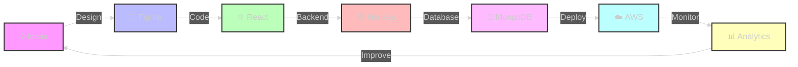

<div align="center">


#  Hey, I'm Nashid K

### 🚀 Full Stack Developer | 🎨 UI/UX Enthusiast | ⚡ MERN Stack Specialist

[](https://git.io/typing-svg)


[](your-portfolio)
[](your-linkedin)
[](mailto:your-email)
[](your-twitter)


</div>

---


## 🎯 About Me

```javascript
class NashidK extends Developer {
  constructor() {
    this.name = "Nashid K";
    this.location = "Bengaluru 🇮🇳";
    this.role = "Full Stack Developer";
    
    this.dailyRoutine = {
      coffee: "☕☕☕",
      code: "💻💻💻",
      debug: "🐛🔧",
      learn: "📚🧠"
    };
    
    this.lifePhilosophy = "Code is poetry written in logic";
  }
  
  getCurrentWork() {
    return [
      "🔨 Building scalable web applications",
      "🎨 Crafting beautiful user interfaces",
      "📖 Learning cloud architecture",
      "🤝 Contributing to open source"
    ];
  }
  
  getSkills() {
    return {
      frontend: ["React", "TypeScript", "Redux", "Tailwind"],
      backend: ["Node.js", "Express", "MongoDB", "PostgreSQL"],
      tools: ["Git", "AWS", "Nginx", "Postman"]
    };
  }
}
```

<br clear="right"/>

---

<div align="center">

## 🛠️ Tech Arsenal

<table>
<tr>
<td align="center" width="100">

<br>JavaScript
</td>
<td align="center" width="100">

<br>TypeScript
</td>
<td align="center" width="100">

<br>React
</td>
<td align="center" width="100">

<br>Redux
</td>
<td align="center" width="100">

<br>Nginx
</td>
<td align="center" width="100">

<br>AWS
</td>
<td align="center" width="100">

<br>GitHub
</td>
</tr>
<tr>
<td align="center" width="100">

<br>Node.js
</td>
<td align="center" width="100">

<br>Express
</td>
<td align="center" width="100">

<br>MongoDB
</td>
<td align="center" width="100">

<br>PostgreSQL
</td>
<td align="center" width="100">

<br>Tailwind
</td>
<td align="center" width="100">

<br>Bootstrap
</td>
<td align="center" width="100">

<br>Postman
</td>
</tr>
</table>

</div>


---

<div align="center">

## 📊 GitHub Analytics


</div>


---

<div align="center">

## 🏆 Achievement Showcase


</div>


---

<div align="center">

## 🎨 Current Projects Vibes


```mermaid
%%{init: {'theme':'dark'}}%%
graph LR
    A[💡 Ideas] -->|Design| B[🎨 Figma]
    B -->|Code| C[⚛️ React]
    C -->|Backend| D[🟢 Node.js]
    D -->|Database| E[🍃 MongoDB]
    E -->|Deploy| F[☁️ AWS]
    F -->|Monitor| G[📊 Analytics]
    G -->|Improve| A
    
    style A fill:#f9f,stroke:#333,stroke-width:2px
    style B fill:#bbf,stroke:#333,stroke-width:2px
    style C fill:#bfb,stroke:#333,stroke-width:2px
    style D fill:#fbb,stroke:#333,stroke-width:2px
    style E fill:#fbf,stroke:#333,stroke-width:2px
    style F fill:#bff,stroke:#333,stroke-width:2px
    style G fill:#ffb,stroke:#333,stroke-width:2px
```

</div>


---

<div align="center">

## 🎯 What I'm Up To

<table>
<tr>
<td align="center" width="33%">

### 🔥 Learning
```diff
+ Cloud Architecture
+ System Design
+ Advanced TypeScript
+ Microservices
```

</td>
<td align="center" width="33%">

### 💻 Building
```javascript
{
  type: "Full Stack",
  focus: "User Experience",
  stack: ["MERN", "TypeScript"],
  status: "In Progress 🚀"
}
```

</td>
<td align="center" width="33%">

### 🌱 Growing
```python
skills = {
    'technical': ['coding', 'design'],
    'soft': ['communication', 'teamwork'],
    'mindset': 'always_learning'
}
```

</td>
</tr>
</table>

</div>


---

<div align="center">

## 💭 Developer Wisdom


</div>


---

<div align="center">

## 😄 Daily Dose of Humor


</div>


---

<div align="center">

## 📈 Weekly Development Breakdown

<!--START_SECTION:waka-->
```text
JavaScript   12 hrs 30 mins  ████████████░░░░░   45.2%
TypeScript   8 hrs 15 mins   ████████░░░░░░░░░   29.8%
CSS          3 hrs 20 mins   ███░░░░░░░░░░░░░░   12.1%
JSON         2 hrs 10 mins   ██░░░░░░░░░░░░░░░    7.8%
Markdown     1 hr 25 mins    █░░░░░░░░░░░░░░░░    5.1%
```
<!--END_SECTION:waka-->

</div>


---

<div align="center">

## 🌟 Featured Work

<details>
<summary><b>🚀 E-Commerce Platform</b></summary>
<br>


**Tech Stack:**
- ⚛️ React + TypeScript
- 🟢 Node.js + Express
- 🍃 MongoDB
- 💳 Payment Integration
- 🔐 JWT Authentication

**Features:**
- 🛒 Shopping Cart
- 💰 Payment Gateway
- 📱 Responsive Design
- 🔍 Product Search
- ⭐ Reviews & Ratings

</details>

<details>
<summary><b>💬 Real-Time Chat Application</b></summary>
<br>


**Tech Stack:**
- ⚛️ React + Redux
- 🟢 Socket.io
- 🍃 MongoDB
- 🎨 Tailwind CSS

**Features:**
- 💬 Real-time Messaging
- 👥 Group Chats
- 📎 File Sharing
- 🔔 Notifications
- 🎨 Custom Themes

</details>

<details>
<summary><b>📊 Dashboard Analytics</b></summary>
<br>


**Tech Stack:**
- ⚛️ React + TypeScript
- 📊 Chart.js
- 🎨 Material-UI
- 🔒 Role-based Access

**Features:**
- 📈 Data Visualization
- 📊 Custom Reports
- 🎯 KPI Tracking
- 📱 Responsive Charts
- 🔐 Secure Access

</details>

</div>


---

<div align="center">

## 🎮 Fun Facts About Me

<table>
<tr>
<td align="center" width="25%">

<br><b>Code Editor</b>
<br>VS Code Dark Theme
</td>
<td align="center" width="25%">

<br><b>Favorite Language</b>
<br>JavaScript & TypeScript
</td>
<td align="center" width="25%">

<br><b>Coffee Counter</b>
<br>☕☕☕ Daily
</td>
<td align="center" width="25%">

<br><b>Debug Style</b>
<br>console.log() everything
</td>
</tr>
</table>

</div>


---

<div align="center">

## 💬 Let's Connect & Collaborate

**I'm always excited to work on:**
```yaml
opportunities:
  - Full-time positions
  - Freelance projects
  - Open source contributions
  - Mentorship programs
  - Tech community events

interests:
  - Web Development
  - UI/UX Design
  - System Architecture
  - Problem Solving
  - Continuous Learning
```

<br>

### 📫 Reach Me At

[](mailto:your-email)
[](your-linkedin)
[](your-twitter)
[](your-portfolio)

<br>

 <em><b>I love connecting with different people</b> so if you want to say <b>hi, I'll be happy to meet you more!</b> 😊</em>

</div>


---

<div align="center">

### ⚡ One Last Thing...


**"Any fool can write code that a computer can understand. Good programmers write code that humans can understand."** - Martin Fowler

<br>

### 🎵 Now Playing

[](https://open.spotify.com/user/your-spotify-id)

<br>


<br>

**Thanks for visiting! Have a productive day! 🚀**


</div>
